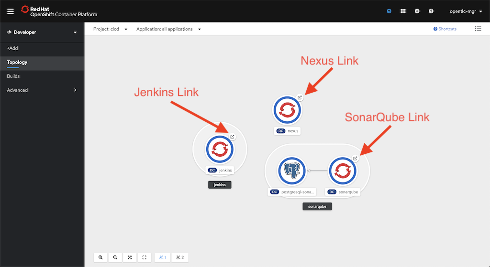

# Exploring the Build

[Back: Settings.xml](04-settings-xml.md)

Now that we have explored some of the configuration of the environment, let's take a look at what has happened during the build process.

Looking back at the *Topology* view of the **CICD** project, you can find the links to the various tool dashboards that our pipline consists of.

## Jenkins

Once you triggered your build *way back* at the end of the first step, you might have noticed that the build progress started to appear in the OpenShift console.  Although this is nice, you get far more info from Jenkins itself.

In the build progress area of the screen, you will see a **View logs** link below the build number.  Click on this and it will take you to the build in Jenkins.  You will need to login with your OpenShift credentials (RBAC!).

Here you can watch the build logs as the build progresses.

If you would prefer to switch to the "Blue Ocean" UI in Jenkins, then click on the *Open Blue Ocean* link in the left side menu.

For a developer's day-to-day work, the Jenkins URL is really all you need to view and start builds.  There's no need to login to the OpenShift UI to monitor builds or build status.  At some point, you will likely want to set your builds up to be triggered by commits to your git repositories, rather than manually triggering them as well.

## Nexus

After your build completes, take a look at your Nexus repository.  The primary role of Nexus is to be the Maven proxy for your organization.  CI/CD tools and developer workstations should all be configured (through settings.xml files in local `.m2` directories) to use Nexus as the Maven mirror.  Not only does this speed up builds and save bandwidth by caching artifacts inside your network, it also allows for control over the external repsitories that can be sources of artifacts and archives the the artifacts that you build.

That being said, when Nexus is working properly you will very rarely ever open the UI.  It is just a proxy, after all.

It's not a bad idea to familiarize yourself with Nexus, though.  After your build completes, open the Nexus UI (you can find the link in the OpenShift CI/CD project by clicking on the "open" decorator on the Nexus pod in the Topology view).

Once in the Nexus UI, explore some of the repositories and you'll find the different Maven dependencies that the build required, as well as the "snapshot" build of your application jar that was uploaded at the end of the `mvn clean deploy` step.

## SonarQube

SonarQube is by far the most interesting tool in this chain.  By adding reporting plugins to our application POM file, and adding equivalent plugins to SonarQube, we can gather metrics about code quality, potential security issues, and vulnerable dependencies.  By surfacing code quality metrics in the form of a unified dashboard, it's much easier for your development teams to build high quality and secure code that meets corporate standards.  From the **Topology** view in the OpenShift **CICD** project, click on the "Open URL" decorator on the SonarQube pod to open the SonarQube UI.  Explore the PetClinic project to see the kinds of reports you can get from your code with very little effort.

## Recap

Although there are certainly more tools we could add to our pipeline (Selenium Hub comes to mind), it's impressive to see how quicly and easily we have deployed and configured a few key industry standard tools, including:
* Jenkins for the build and deploy pipline.
* Nexus as an artifact repository and Maven proxy.
* SonarQube for static code analysis, security analysis, and dependency vulnerability reporting.

[Next: Recap and Additional Resources](06-recap.md)